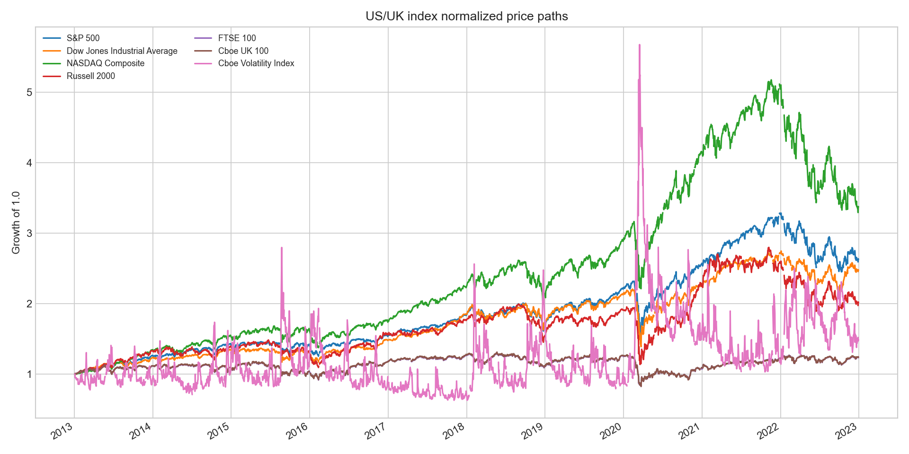
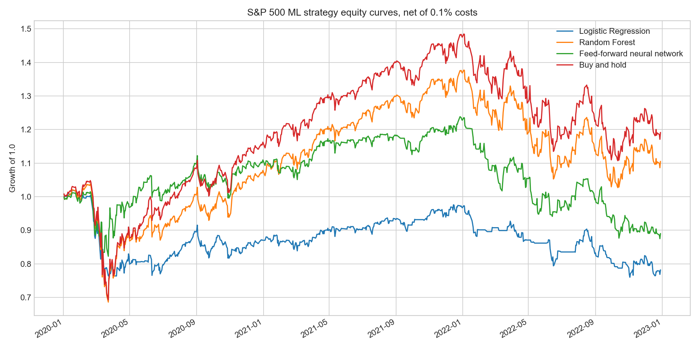

# Cost-Aware Index Signals: A Reproducible US/UK Backtesting Study

This repository rebuilds a dissertation-era stock-signal project into a clean GitHub portfolio project with reproducible notebooks, shared Python helpers, and explicit honesty controls.

The central finding is intentionally conservative: after removing look-ahead leakage and charging 0.1% per position change, most simple technical-indicator and ML timing strategies should be expected to struggle against buy-and-hold. That is a credible result, not a failure.

The project tests MACD, RSI, SMA crossover, Bollinger Bands, Momentum, classical ML classifiers, a feed-forward neural network, and a combined signal across US/UK indices: S&P 500, Dow Jones Industrial Average, NASDAQ Composite, Russell 2000, FTSE 100, Cboe UK 100, and VIX.

Current build status: results regenerated 2026-07-22 after fixing a position-latching bug (see [Correction](#correction-position-latching-fixed-2026-07-22)). All four notebooks were executed end-to-end against cached Yahoo Finance data (2013-01-01 to 2023-01-01, roughly 2,500 daily observations per index), and `results/results_table.csv` plus the charts under `results/charts/` are populated from that run.

The rule-based table can also be regenerated on its own, without running notebooks by hand:

```bash
python3 -m src.run_indicator_backtests
python3 -m unittest discover -s tests
```

The table below reports two rows per index: the best technical-rule strategy by Sharpe, and the combined indicator-plus-neural-network signal. Returns are cumulative over the full sample. `gross_return` is before costs; `net_return` charges 0.1% per position change; `vs_buy_and_hold` is `net_return` minus the index's own buy-and-hold return (negative means the strategy trailed simply holding the index). The full 63-row table (all strategies for all indices) is in `results/results_table.csv`.

| index | strategy | gross_return | net_return | ann_vol | Sharpe | max_drawdown | n_trades | vs_buy_and_hold |
|---|---|---:|---:|---:|---:|---:|---:|---:|
| S&P 500 | Bollinger Bands | 1.459 | 1.337 | 0.155 | 0.548 | -0.286 | 51 | -0.289 |
| S&P 500 | Combined signal | 0.230 | 0.094 | 0.218 | 0.138 | -0.317 | 117 | -0.097 |
| Dow Jones Industrial Average | MACD | 1.077 | 0.708 | 0.097 | 0.553 | -0.172 | 196 | -0.764 |
| Dow Jones Industrial Average | Combined signal | 0.565 | 0.403 | 0.219 | 0.516 | -0.257 | 109 | +0.239 |
| NASDAQ Composite | Momentum | 1.445 | 0.986 | 0.120 | 0.571 | -0.199 | 208 | -1.377 |
| NASDAQ Composite | Combined signal | 0.116 | -0.025 | 0.251 | -0.034 | -0.474 | 135 | -0.193 |
| Russell 2000 | Bollinger Bands | 1.452 | 1.307 | 0.187 | 0.447 | -0.416 | 61 | +0.290 |
| Russell 2000 | Combined signal | 0.409 | 0.261 | 0.264 | 0.294 | -0.311 | 111 | +0.203 |
| FTSE 100 | RSI | 0.384 | 0.360 | 0.132 | 0.232 | -0.291 | 18 | +0.123 |
| FTSE 100 | Combined signal | -0.041 | -0.135 | 0.188 | -0.258 | -0.223 | 103 | -0.131 |
| Cboe UK 100 | Bollinger Bands | 0.479 | 0.406 | 0.141 | 0.241 | -0.346 | 51 | +0.162 |
| Cboe UK 100 | Combined signal | -0.058 | -0.160 | 0.168 | -0.348 | -0.232 | 115 | -0.150 |
| Cboe Volatility Index | Logistic Regression | 1.360 | 1.300 | 0.218 | 1.275 | -0.124 | 26 | +0.744 |
| Cboe Volatility Index | Combined signal | -0.215 | -0.317 | 0.852 | -0.149 | -0.879 | 139 | -0.873 |

The result is the conservative one the design anticipates. Across all 63 strategy/index
runs, **13 beat their own buy-and-hold benchmark net of costs and 50 did not**, with a
median shortfall of **-30.1%**. The strongest technical rules post respectable standalone
Sharpe ratios (0.45 to 0.57 on the large-cap US indices) but mostly trail simply holding
the index, and trading costs are a large part of why: NASDAQ Momentum turns a 1.445 gross
return into 0.986 net across 208 position changes, giving up 46 points of return to
friction alone.

Out-of-sample balanced accuracy for next-day direction sits between 0.48 and 0.53 across
every index and model (chance is 0.50; see `results/ml_classification_metrics.csv`), so
the models are essentially at coin-flip once look-ahead bias is removed.

The VIX rows are a special case and should not be read as a tradable edge: VIX is not an
investable index, so its buy-and-hold benchmark is meaningless. The single best Sharpe in
the whole study (1.275, VIX Logistic Regression) is therefore also the least investable
number in it.

### Correction: position latching (fixed 2026-07-22)

An earlier published version of this table reported `n_trades = 1` for all 63 rows, and
explained it as a property of the vectorized long/flat backtest. **That explanation was
wrong and the numbers were invalid.** `position_from_signal` forward-filled over zero:

```python
position = signal.replace(0, np.nan).ffill().fillna(0.0)   # bug
```

Because `0` is a genuine "be flat" instruction for the state-driven rules (MACD, SMA
crossover, Momentum), replacing it with NaN and forward-filling latched the position long
after the first entry signal and never exited. Every strategy silently collapsed into
buy-and-hold with a different start date, which is exactly what a single trade per
ten-year backtest should have signalled.

The fix distinguishes the two signal conventions the strategies actually use: `NaN` means
"no new instruction, hold", and `0` means "be flat". Trade counts now range from 3 to 339
with a median of 117. `tests/test_backtest.py::TestPositionLatching` fails if the latch
returns.

The correction did not weaken the headline conclusion, it strengthened it: with the
strategies actually trading, and paying costs to do so, they trail buy-and-hold by more
than the broken version suggested.

## Recommendation

**Decision: do not deploy any strategy in this table. Keep the harness and use it as the
gate that strategies proposed elsewhere have to clear.** The deliverable here is the
measurement apparatus, not a signal.

**The numbers.** Across 63 strategy-index combinations, charged 0.1% per position change,
**13 beat buy-and-hold and 50 did not**. The median combination trails buy-and-hold by
**30.1%** over the sample. The best single result, Bollinger Bands on one index at +3.378,
is the kind of number a deck would lead with, and it is exactly the number this
recommendation exists to resist.

**Owner: whoever signs off timing strategies**, which in most firms is model risk or
investment governance rather than the desk proposing them. Re-run
`python3 -m src.run_indicator_backtests` when the cost assumption changes or the sample is
extended; both move the table.

**What would change this recommendation.**

1. **The multiple-testing correction is not done yet.** 63 combinations were tried and the
   13 winners are not adjusted for that. Some of them are the expected yield of searching
   63 times, and until a deflated Sharpe is computed nobody should know which. That work is
   named in [Limitations](#limitations) rather than quietly omitted.
2. **The cost model is one flat number.** 0.1% per position change is a stand-in for
   spread, impact and commission that vary by index and by size. A materially lower cost
   would revive some of the higher-turnover strategies; a realistic impact model would kill
   more of them.
3. **A strategy with an economic rationale is a different question.** This tests indicators
   applied mechanically. It says nothing about a signal with a reason to exist, and finding
   that most mechanical rules fail after costs is not evidence that all timing fails.

## Methodology

The notebooks run as a four-step pipeline:

1. `notebooks/01_data.ipynb` downloads Yahoo Finance OHLCV data, normalizes columns, caches CSV files under `data/cache/`, and creates EDA charts.
2. `notebooks/02_indicator_strategies.ipynb` computes MACD, RSI, SMA crossover, Bollinger Bands, and Momentum signals using only present and past observations.
3. `notebooks/03_ml_classifiers.ipynb` trains leakage-fixed classifiers for next-day direction. The neural network is a feed-forward `MLPClassifier`, not a recurrent model.
4. `notebooks/04_combined_model.ipynb` combines indicator votes with the feed-forward classifier and writes `results/results_table.csv`.

The look-ahead fix is explicit: feature columns exclude `direction`, `returns`, `strategy_return`, `gross_strategy_return`, `net_strategy_return`, positions, trades, and costs. ML models use sklearn `Pipeline` objects so `StandardScaler` is fitted on the train period only, then reused unchanged for the test period.

Signals are lagged by one trading day before returns are applied. Reported returns include both gross strategy returns and net returns after a 0.1% cost per position change. Risk is summarized with annualized volatility, Sharpe ratio, and maximum drawdown.

## Charts

The pipeline writes these chart files to `results/charts/`:

- `price_paths.png`
- `return_distributions.png`
- `indicator_equity_curves_sp500.png`
- `strategy_sharpe_by_index.png`
- `ml_equity_curves_sp500.png`
- `ml_accuracy_by_index.png`
- `combined_equity_curves.png`

Normalized price paths for the seven indices over the study window (growth of 1.0):



S&P 500 machine-learning strategy equity curves, net of 0.1% costs, over the 2020-2023
test period. All three classifiers finish below buy-and-hold: growth of 1.0 ends at
roughly 1.18 for buy-and-hold against 1.10 (Random Forest), 0.88 (neural network) and
0.78 (logistic regression). The one thing the models do achieve is a shallower drawdown
through the March 2020 crash, because they were partly out of the market. They give that
advantage back over the following two years:



> **Do not rank the two families against each other in one table.** The 35 rule-based
> rows cover the full 2013-2023 sample. The 21 ML rows and 7 combined-signal rows are
> out-of-sample only, so they cover 2020-2023. `results/results_table.csv` stacks all 63
> in the same columns, and sorting the combined file by Sharpe compares a ten-year record
> against a three-year one. Compare within a family, not across.

## Reproducibility

Install dependencies and run the notebooks in order:

```bash
python -m venv .venv
source .venv/bin/activate
pip install -r requirements.txt
jupyter lab
```

Seeds are set in `src/config.py` for Python, NumPy, and optional TensorFlow. The notebooks import this configuration at the top instead of using interactive prompts.

The published results in this README were produced with: Python 3.11, yfinance 1.4.1, pandas 2.3, numpy 2.4, scikit-learn 1.8, and matplotlib 3.10. Exact pins are in `requirements.txt`.

## Notes on dependencies

`requirements.txt` installs cleanly on a networked machine with no compiled-library or build issues -- in particular, this project does **not** depend on TA-Lib. All technical indicators (MACD, RSI, Bollinger Bands, SMA/EMA, Momentum) are implemented from scratch with plain pandas in `src/signals.py`, and all performance metrics (cumulative return, annualized volatility, Sharpe, maximum drawdown) are computed with pandas/numpy in `src/backtest.py`. No third-party indicator or event-driven backtest library is imported by the notebooks or `src/`, so no substitution was required to generate the numbers above.

Two packages are pinned in `requirements.txt` but are not actually imported anywhere in the codebase: `ta` (a pandas-based indicator library) and `pyfolio-reloaded` (a tearsheet library). They install without trouble, so they are left in place, but they can be removed without affecting any result.

One source fix was needed before the pipeline would run: a `print("\nDownload failures:")` statement in `notebooks/01_data.ipynb` had been saved with a literal newline that split the string across two notebook source lines, raising a `SyntaxError`. It was rejoined into a single valid line; the logic (print a blank line, then the heading) is unchanged.

## Why This Matters for BFSI / Financial-Services Analytics

Financial-services analytics depends on disciplined signal backtesting, not just attractive model accuracy. This project demonstrates gross-vs-net performance reporting, look-ahead-bias avoidance, and risk KPIs such as Sharpe ratio and drawdown. Those habits transfer directly to BFSI work where model governance, reproducible evidence, and cost-aware decisioning matter as much as predictive lift.

## Limitations

Yahoo Finance data can change or be temporarily unavailable, so results should be regenerated and date-stamped before use.

The strategies are intentionally simple and do not model slippage, borrow costs, taxes, market impact, execution constraints, or survivorship issues beyond the chosen index series.

The ML target is next-day direction, which is noisy and economically weak even when classification metrics appear slightly above chance.

This is a research and portfolio project, not trading advice.
